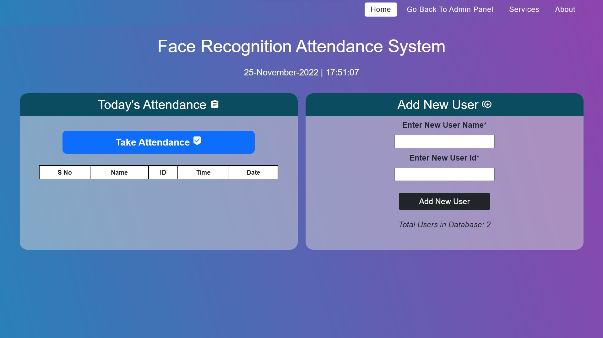

# face-recognition-attendance-system  
Face Recognition-Based Attendance System: (Final Year Project Oct -2023)
Tools: Python, OpenCV, HTML, CSS, PHP, MySQL 
Built a facial recognition system for automating attendance using OpenCV. 
Designed a user-friendly front-end and connected with a backend database

If you want to upgrade this first to use this library given
I serve one the overall project click this folder [Link](https://github.com/Amanchoudhary192002/Face-Recognition-Based-Attendance-System/tree/main/Document/document%20Image)
pip install virtualenv 
#virtualenv env 
#Set-ExecutionPolicy unrestriced
#.\env\Scripts\activate.ps1   To Activate  Virtualenv 
pip install flask    
pip install cv2
pip install opencv-python
pip3 install opencv-python
pip install pandas   
pip install joblib 
pip install numpy    
pip install scipy   
pip install sklearn
pip install numpy  
pip install scipy
pip install sklearn
pip install sklearn.neighbors   
pip install -U scikit-learn

